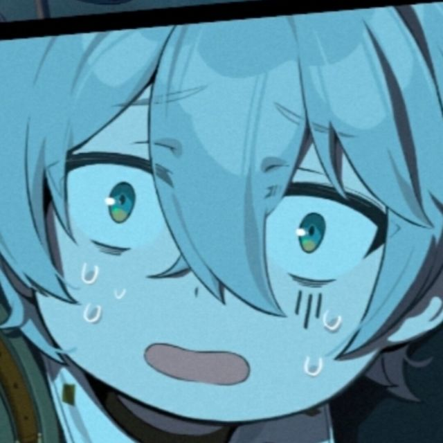

# About SushiMC

> SushiMC is a mountain, but it might also be sushi. Yes, we are sushi, right? Or maybe we're a server... not quite sure.

SushiMC is a Minecraft server project that started in 2026, currently maintained by the SushiMC operations team.
It is a hobby project — we hope to provide quality Minecraft gameplay for our players.

…

Well I can't remember anything. Please **imagine** SushiMC's past, present and future for yourself!

---

# Credits

## Core Development Team

- **OrangeWolf**
    ---
    {: style="height:64px;width:64px;border-radius:50%;float:left;margin-right:12px;margin-bottom:8px;" }
    
    Backend & network development

- **HeartEtc**
    {: style="height:64px;width:64px;border-radius:50%;float:left;margin-right:12px;margin-bottom:8px;" }
    
    Localization, Datapacks, Resourcepacks

- **Octopus**
    {: style="height:64px;width:64px;border-radius:50%;float:left;margin-right:12px;margin-bottom:8px;" }
    
    Founder of SushiMC, free labor.

---

## Contributors

**Mod authors & open source projects**:

* All the developers of the mods installed in SushiMC

* [NeoForge Voxy](https://github.com/JohnSnow14284) Open source contributor

* [LogicWheat](https://b23.tv/q8IV91S) Translation contributor

* [Scarecrow01 aka Flintl0ck](https://www.curseforge.com/members/flintl0ck/projects) resourcepack contributor

* [Haruka317](https://center.mcmod.cn/626183/)

**Beta players**：

* Nickel58, MR_ZH_ZX, Hunyun_Forge, DL_Asparagine, Sylbur42

**And you, dear player of SushiMC**。

---

*This list is continuously updated. If you believe you should be listed here, please contact us via QQ.*
