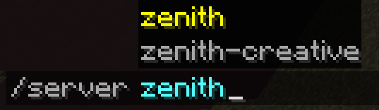
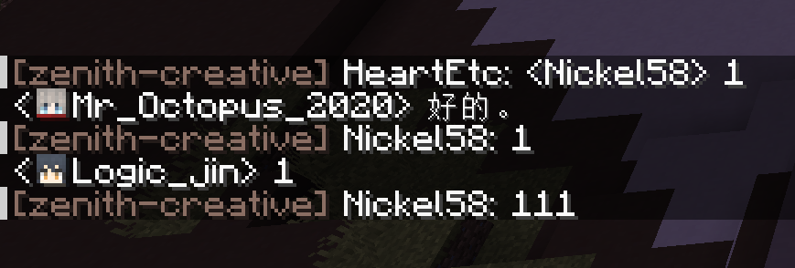
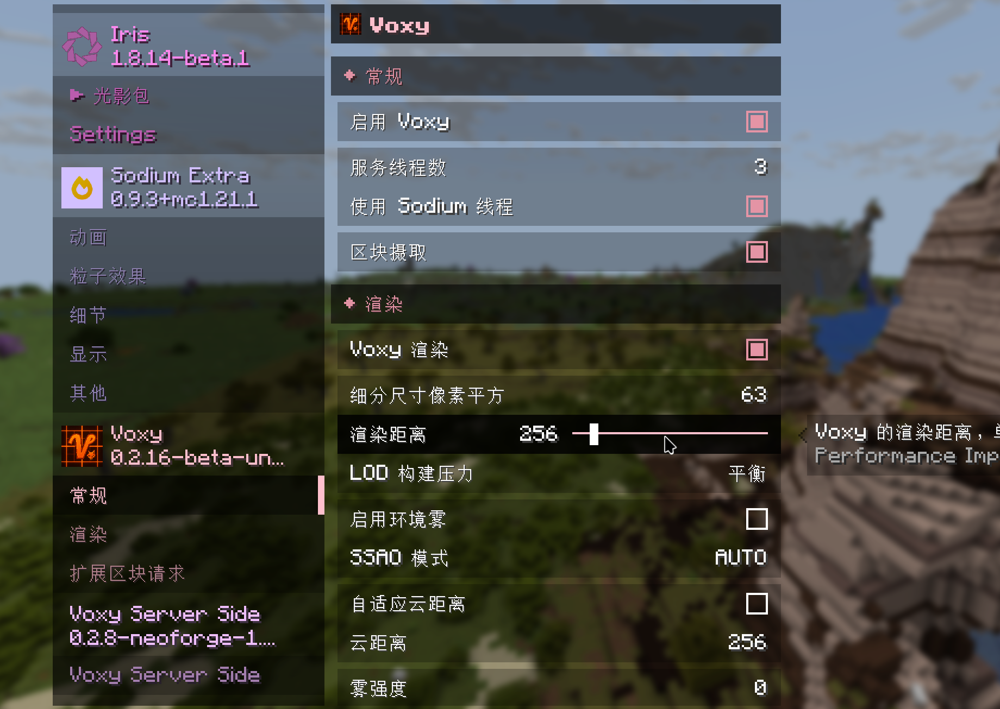
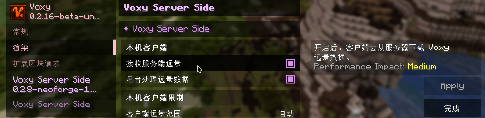
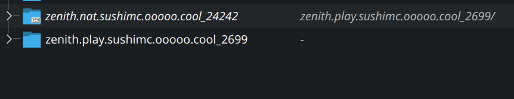

# Zenith

<!-- brief intro -->

Sushi Peak: Zenith entered open beta on July 19, 2026. It is a laid-back modpack focused on **survival, exploration, and building**. The server is still under active development.

---

## Joining Guide {#guide-join}

> This guide helps you install the Sushi Peak: Zenith modpack and configure the necessary settings.

### Installing the Modpack

First, join the Sushi Peak QQ group: **`1045084460`**

In the group files, find the modpack folder, locate "Zenith", and **download the latest version**.

Then, **install the modpack into your Minecraft launcher**. Generally, you can drag the modpack file into your launcher window.

The installation **requires an internet connection**. If you have trouble downloading game files or mods, try again a few times.

!!! note "About Launchers"

    The official Minecraft launcher cannot install third-party modpacks. We recommend using a third-party launcher.

### Configuring the Modpack

After installation, go to the modpack's **settings**, find `JVM arguments`, and enter:

```JVM
-javaagent:patch.jar
```

For specific launcher setting guide, please refer to the launcher's official docs.

!!! note "Why there's no image guide?"
    
    We re sorry but our development team have no experience of using a non-Chinese Minecraft launcher. If you're interested in contributing image guide, please contact us via QQ.

This parameter connects your game to the Sushi Peak update service and keeps your client on the latest version.

Once configured, you can launch the Sushi Peak: Zenith modpack!

!!! warning "Important Notes"
    1. Make sure to set the JVM parameter in the **modpack's version settings**, not the global launcher settings. If you put it in the global settings, you won't be able to play other Minecraft versions normally.
    2. On **Windows**, the modpack installation path must contain **only ASCII characters**. If your `.minecraft` folder path contains non-ASCII characters (e.g., your Windows username contains Chinese characters), see the [Services](#update-service) section below for help.

---

## Gameplay Guide

> A quick overview of common things to know about Sushi Peak: Zenith.

### Network Lines

After launching, click `Multiplayer` and you'll see several network lines:

| Line | Description |
|------|-------------|
| Direct | Connect directly to our server machine. Usually **laggy** if you're not in China. |
| Direct-UDP | For testing purpose. |
| NAT | Worth trying. This network line has slightly lower network load to our machines, and usually turns out **great in connection quality**. |
| NAT-UDP | For testing purpose. |
| EO | Low bandwidth, but accessible across the world. You may try this if you're far away from China. |

!!! tip "Ping"

    Press `TAB` in-game to open the player list and see your **ping**. It may show `-1` right after joining — wait a moment for it to update.

### Proxy Server Commands



Use `/server` to switch between sub-servers:

| Server | Purpose |
|--------|---------|
| `zenith` | **Main survival server** — where most players hang out |
| `zenith-creative` | Creative mode for schematic and testing |

### Cross-server Chat



You can see chat from all sub-servers on the Sushi Peak network. Messages from players on the same server as you appear normally, while messages from other servers are prefixed with the server name before the player name.

### Voxy Mod

The Sushi Peak: Zenith modpack comes with the **Voxy** distance extension mod by default. You can adjust your desired render distance in the video settings.



The server provides a maximum render distance of **16 chunks** and sends up to **256 chunks** of Voxy scenery. You can adjust how much Voxy data you want to receive in the Voxy Server Side mod settings.



Voxy supports shaders on Sushi Peak: Zenith. We recommend [**Complementary**](https://modrinth.com/shader/complementary-unbound) shaders with the [**Euphoria Patches**](https://modrinth.com/mod/euphoria-patches) mod for great performance and visuals.

!!! warning "Voxy Performance"

    Voxy is well-optimized, but some devices may still struggle. If you experience performance issues, you can disable **Enable Voxy** and **Receive Server-Side Scenery** in the video settings.

---

## Advanced Tips

> These tips can improve your experience but are entirely optional.
>
> They may require some technical knowledge. Don't worry if you can't follow — you **don't need** to do any of this to enjoy Sushi Peak: Zenith.

### Syncing Xaero Maps Across Lines {#data-sync}

If you frequently switch network lines, your **Xaero map** data will be separate for each line, because the game treats each line as a different server. You can work around this with a bit of effort.

??? tip "Data Sync (for advanced users)"

    1. Open your version folder and find the `xaero` directory, containing `minimap` (minimap) and `world-map` (fullscreen map) subdirectories
    2. **Keep** one line's map folders, **delete** the others
    3. Create **shortcuts** (Windows) or **symlinks** (Linux/macOS) pointing to the kept folders

    All lines will now share the same map data — set it and forget it.

### Syncing Voxy Chunk Cache Across Lines

Similar to above, you may notice that after switching lines, your **Voxy chunk cache** is gone and needs to reload. You can apply the same [Data Sync](#data-sync) approach to the `.voxy` directory in your version folder — create shortcuts or symlinks so the chunk cache is shared across lines. The final folder structure might look like this:



---

## Services

> Public services available for Sushi Peak: Zenith players.

### Auto-Update Service {#update-service}

If you set the JVM parameter as described in the [Joining Guide](#guide-join), your client will **check for updates automatically** on launch. No need to reinstall the modpack for every update.

!!! warning "Update Issues"

    If you see an error window on launch, something is wrong with the update service. Please ask politely in the QQ group for help.

### Other Services

Web map, statistics, monitoring — still under construction.
