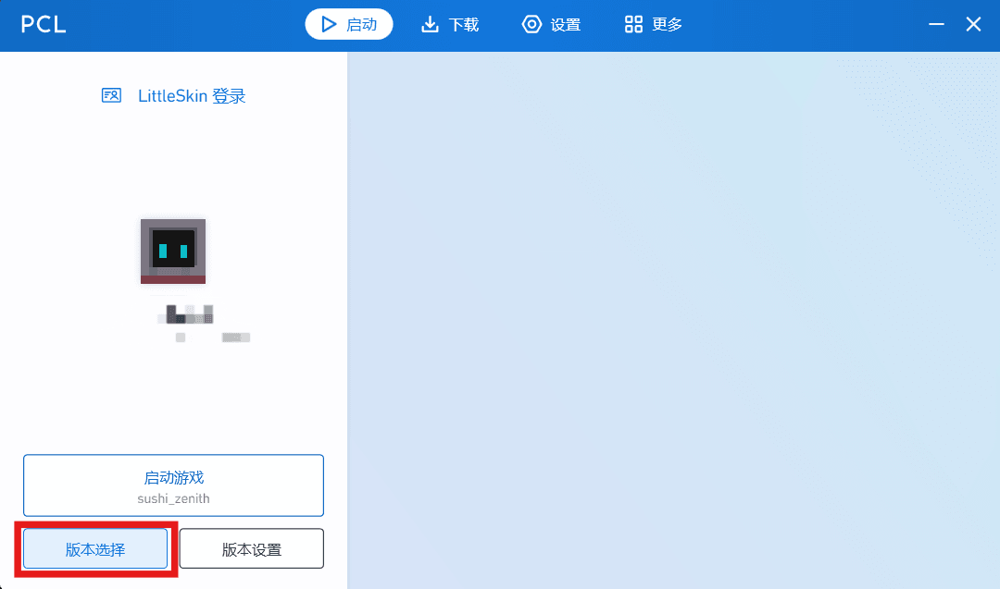
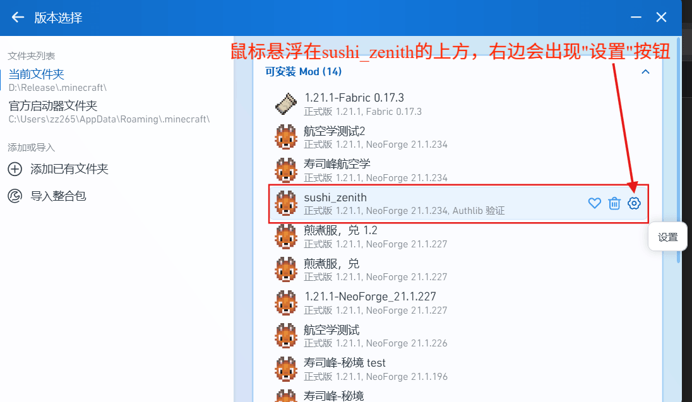
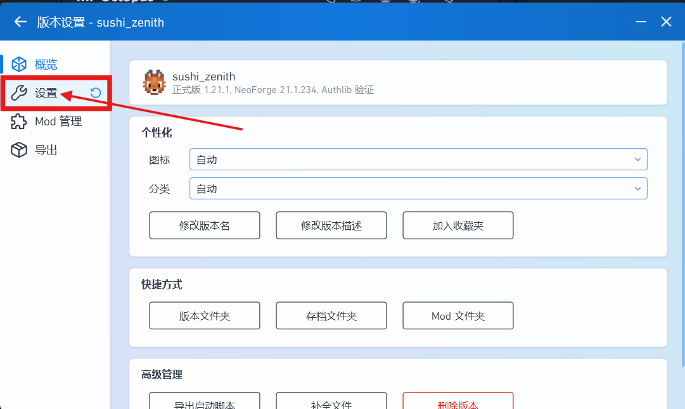
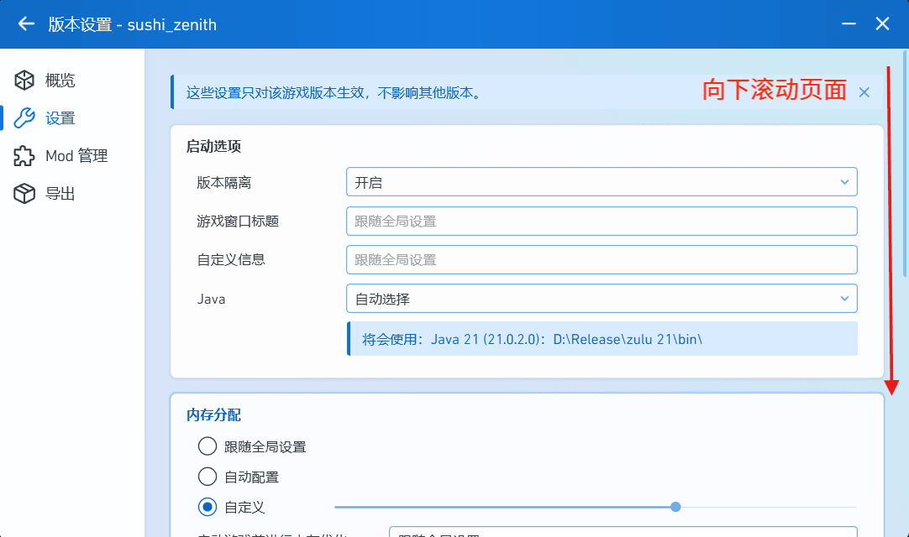
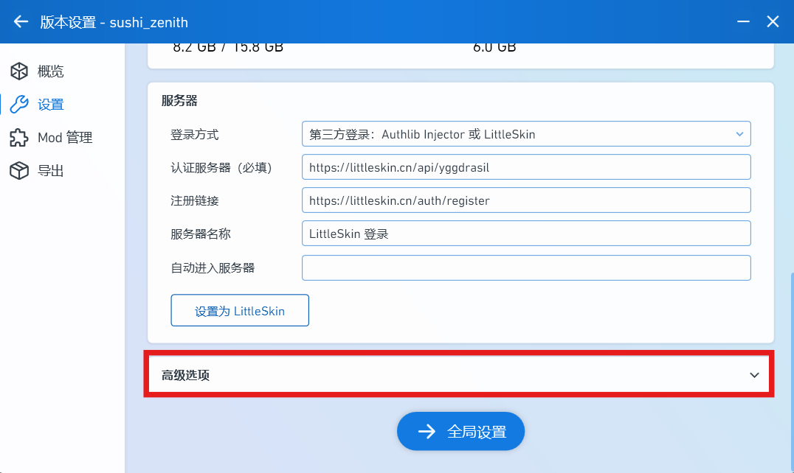
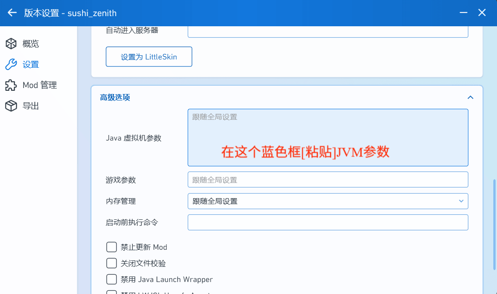
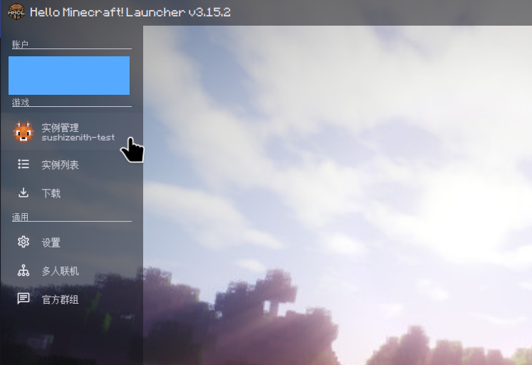
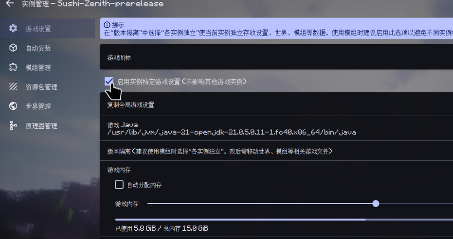
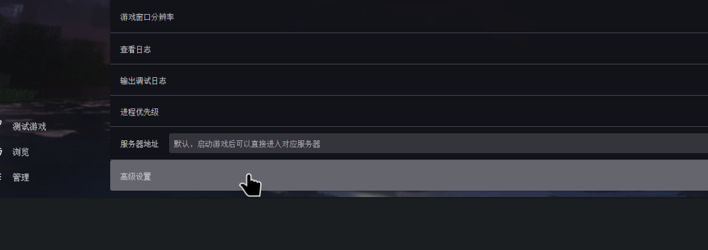
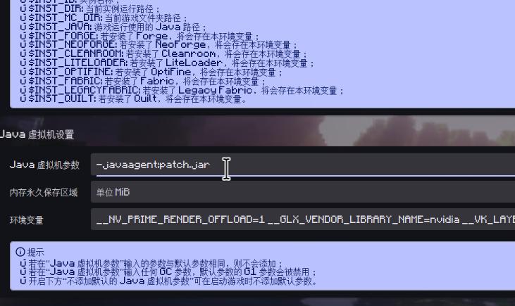

# 苍穹

<!-- 玩法简介 -->

寿司峰：苍穹 公测版发布于 2026年7月19日，以养老，探索，建筑为玩法主题。该服务器玩法目前仍在积极建设中。

---

## 进服指南 {#guide-join}

> 该指南将帮助您安装 寿司峰：苍穹 整合包，并调整好必要的设置。

### 安装整合包

首先访问寿司峰玩家 **QQ 群：`1045084460`**

在群文件中，您可以找到整合包文件夹。在文件夹中找到"苍穹"，并**下载最新版本**。

然后，**将整合包安装到您的 Minecraft 启动器中**。对于启动器安装整合包的方式，请您单独查阅启动器文档。一般来说，用鼠标将整合包文件拖入启动器窗口即可。

整合包安装**需要联网**。如果您无法正常下载游戏文件和模组文件，请重试几次。

!!! note "关于启动器"

    官方启动器无法安装第三方整合包。如果您使用官方启动器，建议尽快换成诸如 PCL2、HMCL 等热门第三方启动器。（现在真的还有人用官启吗😅）

### 设置整合包

  安装好后，请在整合包版本设置的`高级设置`中找到`JVM参数`，并输入：

```JVM
-javaagent:patch.jar
```

一些启动器的设置位置如下：

#### PCL2 设置步骤

① 选择版本



② 打开高级设置









③ 找到 JVM 参数



#### HMCL 设置步骤

① 选择版本



② 打开高级设置





③ 找到 JVM 参数



这些参数会让您的游戏连接到寿司峰更新服务，并保持您的客户端是最新版。

!!! warning "一些注意事项"
    1. 记得把上述JVM参数设置在整合包版本设置里。如果您把它填进全局设置里，您就玩不了除寿司峰以外的其他版本了。
    2. 对于 Windows 操作系统，整合包安装的路径中**只能包含英文字符**。也就是说，您的 .minecraft 文件夹的绝对路径**不能包含中文**。如果必须包含（比如您的用户名包含中文），请参见下方[相关服务](zenith.md#update-service)章节。

### 选择登录方式

为了安全和兼容性，寿司峰：苍穹 仅支持 [LittleSkin](https://littleskin.cn) 登录。

如果您是正版玩家，您可以前往 LittleSkin 网站，将您的正版账号绑定到 LittleSkin。

如果您没有正版账户，您也可以在 LittleSkin 注册免费的账户并加入服务器游玩。

完成上述设置后，您就可以启动 寿司峰™苍穹 整合包了。

---

## 游戏指南

> 该指南将带您简单了解 寿司峰：苍穹 的一些常见游戏知识。

### 各种网络线路

启动游戏后，点击`多人游戏`，您会看到很多网络线路。目前我们有下列线路：

线路 | 说明
---|---
**直连** | ✅ **推荐** —— 最流畅，对服务器资源消耗最小
直连-UDP | 
NAT | 直连延迟高时可尝试，**平均延迟更高**，但对中西部地区连接质量更好
NAT-UDP | 
EO | 高峰期（`19:30 - 22:00`）使用，可缓解高峰期卡顿，但区块加载较慢

!!! tip "查看延迟"

    加入服务器后，按 `TAB` 键打开玩家列表，即可查看您的**连接延迟**（Ping）。刚连接时延迟会显示为 `-1`，稍等片刻即可正常显示。

### 群组服务器


加入服务器后，使用 `/server` 命令切换子服务器：

| 服务器 | 用途 |
|--------|------|
| `zenith` | **一般生存服务器**，玩家们主要在这里游玩 |
| `zenith-creative` | 创造模式服务器，可用于制作蓝图、测试机器等 |

### 跨服聊天


您可以看到 寿司峰 所有群组服务器的聊天。与您一起游玩的玩家的聊天消息会像原版一样出现，而来自其他服务器的聊天会在玩家名称前标注服务器代号。


### Voxy模组相关

默认情况下，寿司峰：苍穹 整合包带有 Voxy 视距扩展模组。您可以在视频设置中调整您想要的视距。


寿司峰的服务器会向您提供最大 **16区块** 的渲染距离，同时向您发送最大 **256区块** 的 Voxy 景色。您可以在 Voxy Server Side 模组设置中调整您想要接收多远的景色数据。


寿司峰：苍穹 的 Voxy 模组支持光影。我们推荐您使用 [Complementary](https://modrinth.com/shader/complementary-unbound) 光影，并安装 [Euphoria Patches](https://modrinth.com/mod/euphoria-patches) 模组，来获得优秀的性能与美观的显示效果。

!!! warning "关于 Voxy 性能"

    Voxy 模组本身的优化十分优秀，但这仍然无法让一些设备流畅运行。如果您发现您的设备性能不足以渲染 Voxy 区块，您可以在视频设置中关闭`启用Voxy`以及`接收服务端远景`两项设置。

---

## 高级玩法指南

> 该指南将指导您进行一些高级设置，改善游戏体验。
>
> 这些设置可能需要您掌握一些计算机使用知识。如果您阅读完指南后还是搞不懂如何操作，不用担心，您**不需要**做这些设置也能正常游玩 寿司峰：苍穹。

### 不同线路之间的地图同步 {#data-sync}

如果您经常切换线路，您可能会发现不同线路之间的 **Xaero 地图**数据是**相互分割**的，因为它认为这些线路是不同的服务器。虽然您可以在 Xaero 地图设置中将不同线路的地图连接起来，但这很麻烦，并且需要您反复操作。
如果您愿意花点时间，可以看看这份数据同步指南。

??? tip "数据同步（适合进阶玩家）"

    1. 打开版本文件夹，找到 `xaero` 文件夹，里面有两个子目录：`minimap`（小地图）和 `world-map`（全屏世界地图）
    2. **保留**其中一条线路的地图文件夹，将其他线路的同名文件夹**删除**
    3. 为删除掉的文件夹创建指向保留文件夹的**快捷方式**（Windows）或**软链接**（Linux/macOS）

    这样所有线路的地图都会指向同一个存储位置，一劳永逸。
    
    
### 不同线路之间的 Voxy 区块缓存同步

与上面类似，您切换线路后可能注意到** Voxy 区块缓存都消失了**，需要重新加载。您可以按照上面的 [数据同步](zenith.md#data-sync) 部分，将版本文件夹下`.voxy`目录的几个文件夹也用快捷方式或软链接处理一下，这样区块缓存就也会在不同线路之间同步。最后的文件夹结构可能是这样的：


---

## 相关服务

> 您可以在这里找到 寿司峰：苍穹 面向玩家开放的一些相关服务。

### 寿司峰更新服务 {#update-service}

如果您按照 [进服指南](#guide-join) 设置了 JVM 参数，您的客户端会在游戏启动时**自动检查更新**。这会保证您的客户端始终与最新版 寿司峰：苍穹 整合包同步，您不需要在每次更新时重新安装整合包。

!!! warning "更新服务异常"

    如果您的更新服务出现问题，您会在游戏启动时看到错误窗口。对于这些问题，请在玩家 QQ 群中礼貌询问，寻求解决办法。
    
    如果您的 .minecraft 路径中有中文，那么您将无法使用自动更新服务。此时，您可以打开版本文件夹，双击运行 `update.exe` 来完成更新。

### 其他服务

其他相关服务（比如网页地图、统计信息、监控站等）仍在建设中。
